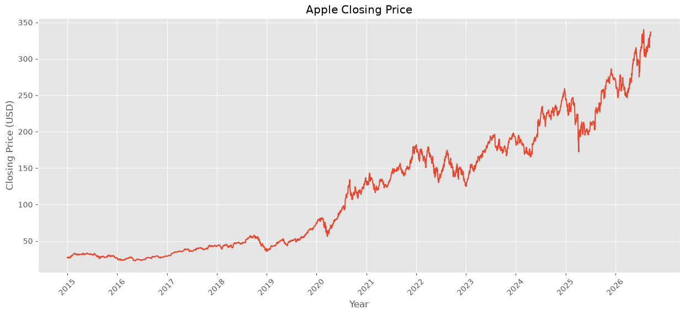
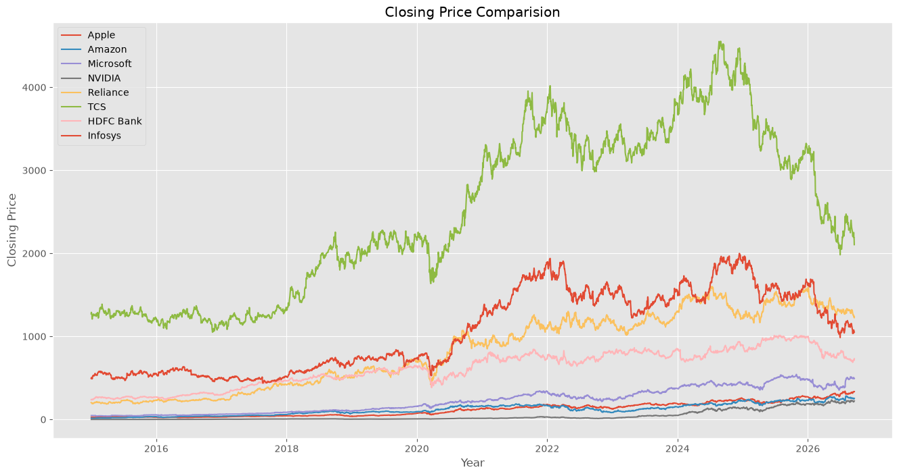
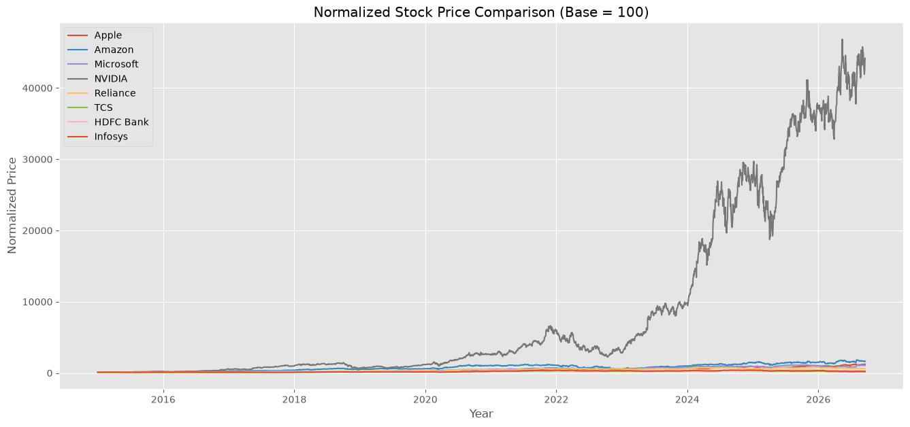
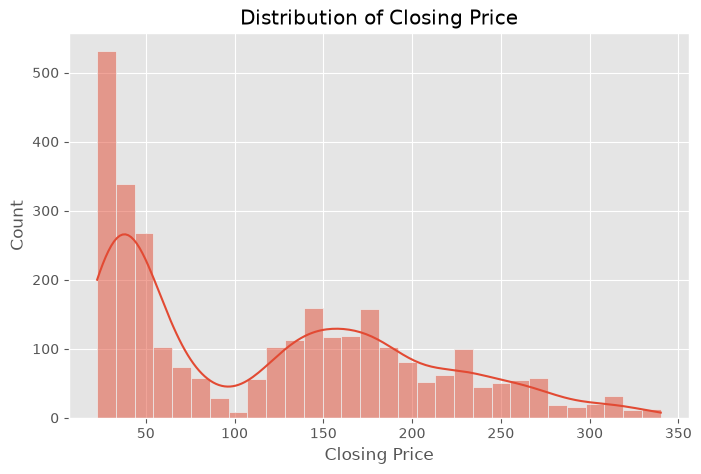
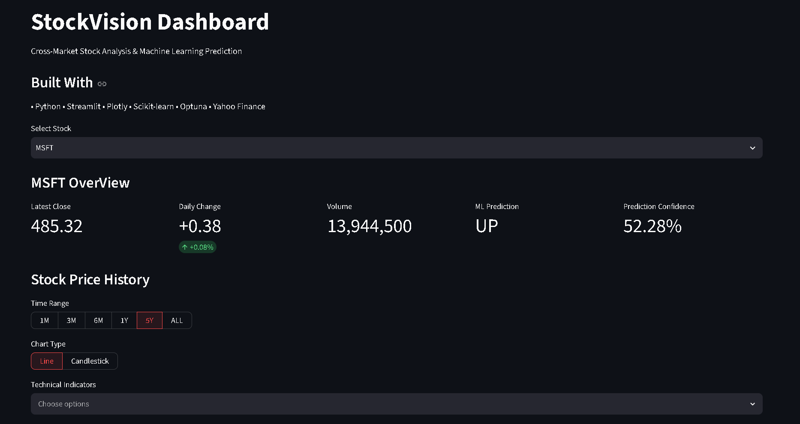
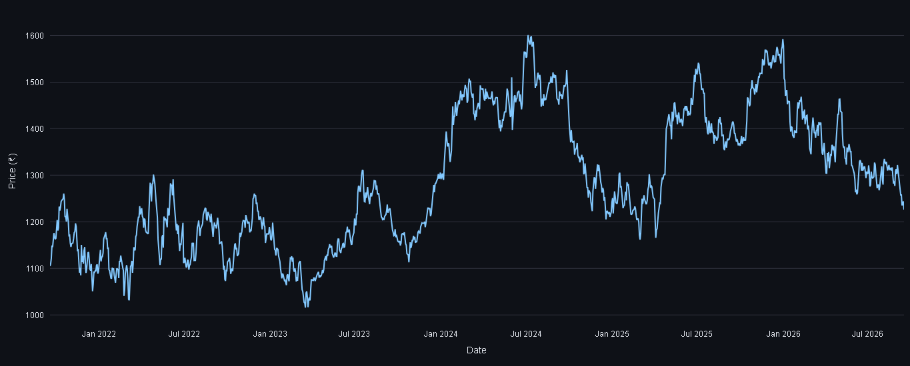
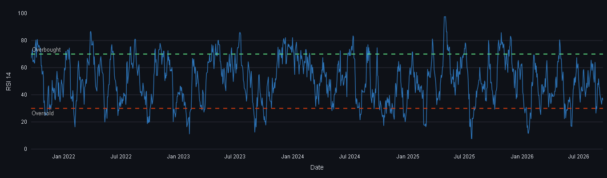
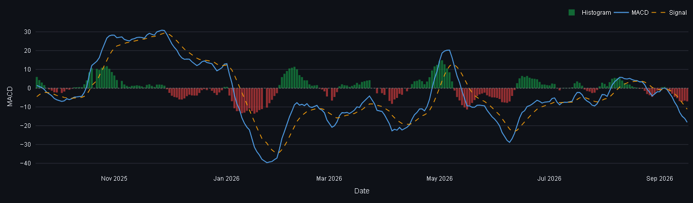

# 📈 StockVision

> **An End-to-End Machine Learning Stock Market Analysis Dashboard**

StockVision is an end-to-end machine learning project that analyzes and compares the historical performance of major US and Indian stocks. It integrates data collection, feature engineering, machine learning, hyperparameter tuning, prediction, and an interactive Streamlit dashboard into a complete data science pipeline.

The project is built for educational purposes and demonstrates how machine learning can be applied to stock market trend prediction using historical market data and technical indicators.

---

## 🚀 Features

### 📊 Data Pipeline
- Historical stock data collection using Yahoo Finance
- Automated data cleaning and preprocessing
- Organized project structure for reproducible workflows

### 📈 Exploratory Data Analysis
- Statistical analysis of stock prices
- Trend visualization
- Return distribution analysis
- Volatility comparison
- Correlation analysis
- Comparative study between US and Indian markets

### ⚙️ Feature Engineering
Technical indicators including:
- SMA (Simple Moving Average) — 5, 20, 50 day
- EMA (Exponential Moving Average) — 20 day
- RSI (Relative Strength Index, 14 day)
- MACD, MACD Signal, MACD Histogram
- Daily Returns & Lagged Returns
- Volume Change
- High-Low Range
- Open-Close Change
- Rolling Volatility (20 day)

### 🤖 Machine Learning
Implemented multiple classification models to predict next-day price direction (up/down):

- Logistic Regression
- Random Forest (default)
- Random Forest (tuned with Optuna)

Model selection is performed individually for each stock, and the best-performing model is saved for prediction.

### 📋 Model Evaluation
Models are evaluated using:

- Accuracy
- Precision
- Recall
- F1 Score

The best-performing model for each stock is automatically selected and saved for prediction.

### 📊 Interactive Dashboard
Built using Streamlit and Plotly.

Dashboard includes:

- Latest market overview (close price, daily change, volume)
- AI-based price movement prediction with confidence score
- Interactive stock price chart (Line & Candlestick)
- Configurable time-range selection (1M / 3M / 6M / 1Y / 5Y / ALL)
- SMA & EMA overlays
- RSI visualization with overbought/oversold zones
- MACD visualization with signal line and histogram
- Model performance comparison across stocks

---

## 📂 Project Structure

```text
StockVision/
│
├── data/
│   ├── raw/            # Unprocessed data pulled from Yahoo Finance
│   ├── cleaned/         # Cleaned, deduplicated data
│   ├── processed/       # Data with technical indicators added
│   └── ml_ready/        # Final feature/target tables used for training
│
├── images/             # EDA & comparative-analysis plots (see note below)
│
├── models/
│   ├── best_rf_params.json
│   └── final/
│       └── *.joblib     # One trained model per stock
│
├── notebooks/
│   ├── 01_data_collection.ipynb
│   ├── 02_data_cleaning.ipynb
│   ├── 03_EDA.ipynb
│   ├── 04_Comparative_Analysis.ipynb
│   ├── 05_Feature_Engineering.ipynb
│   ├── 06_ml_data_preparation.ipynb
│   ├── 07_model_training.ipynb
│   ├── 08_Hyperparameter_Tuning.ipynb
│   ├── 09_Final_Model_Evaluation.ipynb
│   └── 10_prediction_pipeline.ipynb
│
├── results/             # Model comparison CSVs (logistic, default RF, tuned RF)
│
├── src/
│   ├── config.py               # Paths, stock list, feature list
│   ├── download_data.py        # Pulls raw OHLCV data from Yahoo Finance
│   ├── clean_data.py           # Cleans and deduplicates raw data
│   ├── feature_engineering.py  # Adds technical indicators
│   ├── prepare_ml_data.py      # Builds the ML-ready target/feature table
│   ├── prediction.py           # Loads a trained model and predicts next move
│   ├── data_loader.py          # Loads processed data for the dashboard
│   └── company_info.py         # Static company metadata (sector, exchange, etc.)
│
├── app.py                # Streamlit dashboard entry point
├── requirements.txt
└── README.md
```

---

## 🖼️ About the `images/` Folder

The `images/` folder currently holds **exploratory-analysis charts**, not dashboard screenshots:

- `closing_price_trend.png` — single-stock closing price trend
- `multi_company_closing_prices.png` — closing price comparison across all 8 stocks
- `normalized_comparison.png` — normalized price comparison (US vs India)
- `price_distribution.png` — return/price distribution analysis

These were generated during the EDA / comparative-analysis notebooks and are referenced in the **Exploratory Data Analysis** section below — no action needed for these.

However, this README also references **dashboard screenshots** (`dashboard_overview.png`, `dashboard_rsi.png`, `dashboard_macd.png`) that don't exist yet in the folder. To finish the README:

1. Run the dashboard locally: `streamlit run app.py`
2. Take screenshots of: the overview/metrics section, the price chart, the RSI panel, and the MACD panel
3. Save them into `images/` using the filenames referenced in the **Dashboard Preview** section below (or update the filenames in this README to match whatever you name them)

---

## 📌 Workflow

```text
Yahoo Finance
      │
      ▼
Data Collection       (src/download_data.py)
      │
      ▼
Data Cleaning          (src/clean_data.py)
      │
      ▼
EDA & Comparative Analysis   (notebooks 03, 04)
      │
      ▼
Feature Engineering     (src/feature_engineering.py)
      │
      ▼
ML Data Preparation     (src/prepare_ml_data.py)
      │
      ▼
Model Training           (Logistic Regression, Random Forest)
      │
      ▼
Hyperparameter Tuning    (Optuna)
      │
      ▼
Final Model Selection    (results/final_model_selection.csv)
      │
      ▼
Prediction Pipeline      (src/prediction.py)
      │
      ▼
Streamlit Dashboard      (app.py)
```

---

## 📈 Stocks Included

### 🇺🇸 United States
- Apple (AAPL)
- Microsoft (MSFT)
- NVIDIA (NVDA)
- Amazon (AMZN)

### 🇮🇳 India
- Reliance Industries (RELIANCE.NS)
- Tata Consultancy Services (TCS.NS)
- HDFC Bank (HDFCBANK.NS)
- Infosys (INFY.NS)

---

## 🛠️ Tech Stack

### Programming Language
- Python

### Data Analysis
- NumPy
- Pandas

### Visualization
- Matplotlib
- Seaborn
- Plotly

### Machine Learning
- Scikit-learn
- Optuna

### Dashboard
- Streamlit

### Data Source
- Yahoo Finance (yfinance)

---

## 📊 Exploratory Data Analysis

### Closing Price Trend (Apple)


### Multi-Company Closing Price Comparison


### Normalized Price Comparison


### Price/Return Distribution


---

## 📸 Dashboard Preview

> Screenshots below are placeholders — see the [`images/` folder note](#️-about-the-images-folder) above for how to generate and add them.

### Overview

### Price Chart


### RSI


### MACD


---

## ⚡ Installation

Clone the repository

```bash
git clone https://github.com/yourusername/StockVision.git
```

Move into the project directory

```bash
cd StockVision
```

Install dependencies

```bash
pip install -r requirements.txt
```

Run the Streamlit application

```bash
streamlit run app.py
```

> **Note:** The dashboard reads from `data/processed/`, `models/final/`, and `results/final_model_selection.csv`. If you're starting from raw data instead of the files already included in this repo, run the pipeline notebooks/scripts in order (see **Workflow** above) before launching the app.

---

## 📊 Machine Learning Pipeline

1. Data Collection
2. Data Cleaning
3. Exploratory Data Analysis
4. Feature Engineering
5. ML Data Preparation
6. Logistic Regression
7. Random Forest
8. Hyperparameter Tuning (Optuna)
9. Final Model Selection
10. Prediction Pipeline
11. Streamlit Deployment

---

## 🎯 Future Improvements

- Live stock data integration
- Additional machine learning models (XGBoost, LightGBM)
- Deep learning models (LSTM)
- Portfolio analysis
- Model explainability using SHAP
- Cloud deployment

---

## ⚠️ Disclaimer

This project is intended for educational and learning purposes only.

The predictions generated by the machine learning models should **not** be considered financial advice or investment recommendations.

---

## 👨‍💻 Author

**Prins Satapara**

- GitHub: *(Add your GitHub profile)*
- LinkedIn: *(Add your LinkedIn profile)*

---

⭐ If you found this project useful, consider giving it a star!