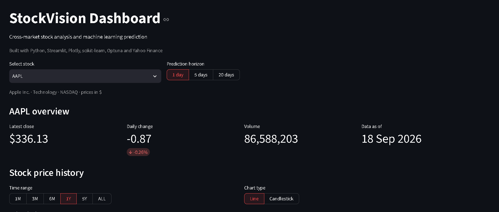
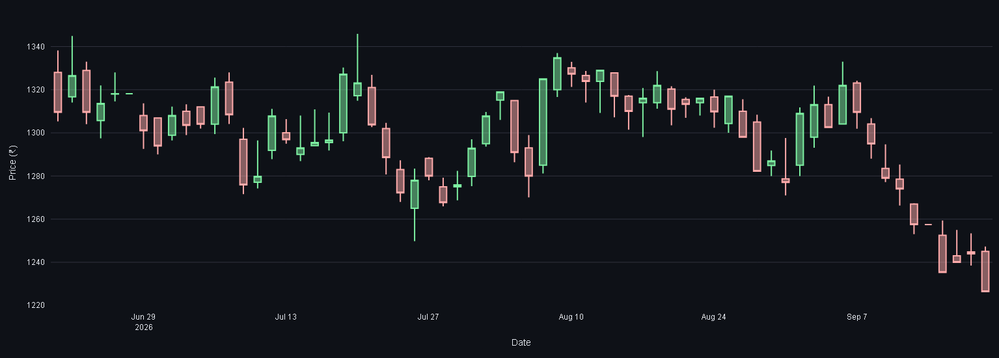
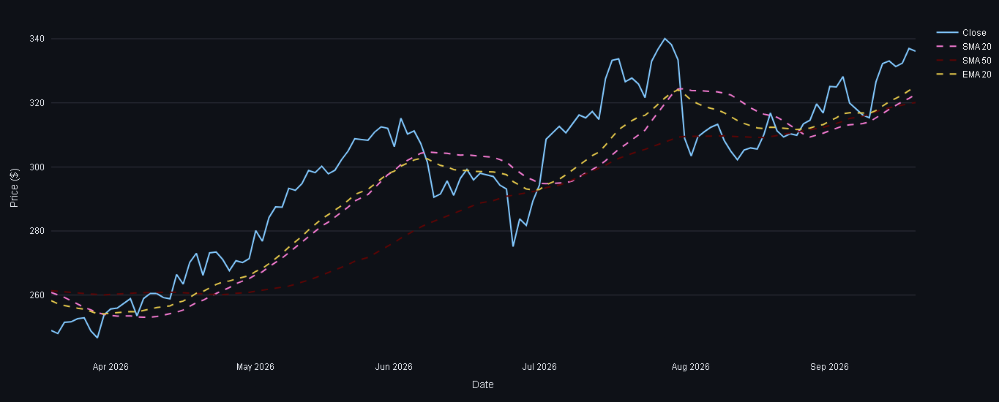
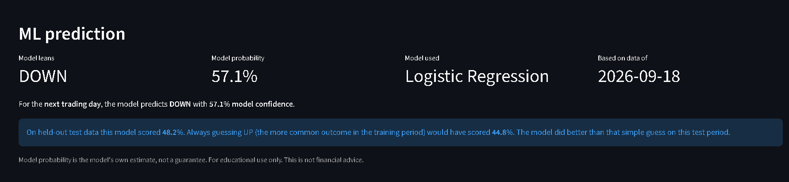
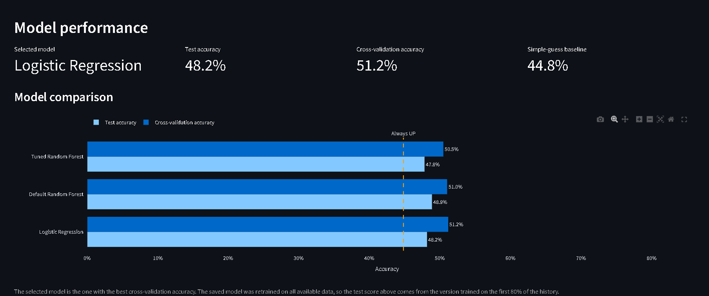
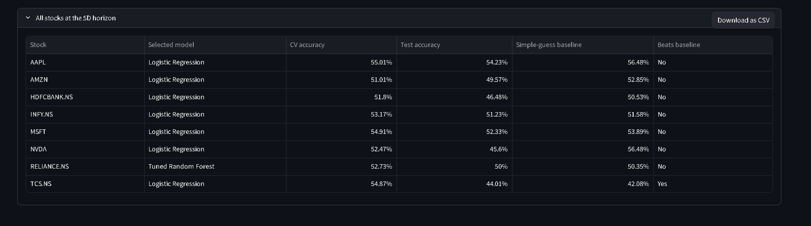

# 📈 StockVision

> **An End-to-End Machine Learning Stock Market Analysis Dashboard**

StockVision is an end-to-end machine learning project that analyzes and compares the historical performance of major US and Indian stocks. It integrates data collection, feature engineering, machine learning, hyperparameter tuning, prediction, and an interactive Streamlit dashboard into a complete data science pipeline.

The project is built for educational purposes and demonstrates how machine learning can be applied to stock market trend prediction using historical market data and technical indicators.

---

## 🚀 Features

### 📊 Data Pipeline
- Historical stock data collection using Yahoo Finance
- Automated data cleaning and preprocessing
- Organized project structure for reproducible workflows

### 📈 Exploratory Data Analysis
- Statistical analysis of stock prices
- Trend visualization
- Return distribution analysis
- Volatility comparison
- Correlation analysis
- Comparative study between US and Indian markets

### ⚙️ Feature Engineering
Technical indicators including:
- SMA (Simple Moving Average) — 5, 20, 50 day
- EMA (Exponential Moving Average) — 20 day
- RSI (Relative Strength Index, 14 day)
- MACD, MACD Signal, MACD Histogram
- Daily Returns & Lagged Returns
- Volume Change
- High-Low Range
- Open-Close Change
- Rolling Volatility (20 day)

### 🤖 Machine Learning
Implemented multiple classification models to predict stock price direction (up/down) across 1D, 5D, and 20D horizons:

- Logistic Regression
- Random Forest (default)
- Random Forest (tuned with Optuna)

Model selection is performed individually for each stock and prediction horizon, and the best-performing model is saved for prediction.

### 🕐 Prediction Horizons

StockVision supports three prediction horizons:

- **1D** — next trading day
- **5D** — next 5 trading days
- **20D** — next 20 trading days

A separate final model is selected and saved for every stock and every horizon, giving **8 stocks × 3 horizons = 24 final models**.

### 📋 Model Evaluation
Models are evaluated using:

- Accuracy
- Precision
- Recall
- F1 Score

The best-performing model for each stock is automatically selected and saved for prediction.

### 📊 Interactive Dashboard
Built using Streamlit and Plotly.

Dashboard includes:

- Latest market overview (close price, daily change, volume)
- ML-based price movement prediction with model confidence
- Interactive stock price chart (Line & Candlestick)
- Configurable time-range selection (1M / 3M / 6M / 1Y / 5Y / ALL)
- SMA & EMA overlays
- RSI visualization with overbought/oversold zones
- MACD visualization with signal line and histogram
- Model performance comparison across stocks and prediction horizons
- All-stock prediction summary for the selected horizon

---

## 📂 Project Structure

```text
StockVision/
│
├── data/
│   ├── raw/            # Unprocessed data pulled from Yahoo Finance
│   ├── cleaned/         # Cleaned, deduplicated data
│   ├── processed/       # Data with technical indicators added
│   └── ml_ready/        # Final feature/target tables used for training
│
├── images/             # EDA & comparative-analysis plots (see note below)
│
├── models/
│   ├── best_rf_params.json
│   └── final/
│       └── *.joblib     # One trained model per stock and prediction horizon
│
├── notebooks/
│   ├── 01_data_collection.ipynb
│   ├── 02_data_cleaning.ipynb
│   ├── 03_EDA.ipynb
│   ├── 04_Comparative_Analysis.ipynb
│   ├── 05_Feature_Engineering.ipynb
│   ├── 06_ml_data_preparation.ipynb
│   ├── 07_model_training.ipynb
│   ├── 08_Hyperparameter_Tuning.ipynb
│   ├── 09_Final_Model_Evaluation.ipynb
│   └── 10_prediction_pipeline.ipynb
│
├── results/             # Model comparison CSVs (logistic, default RF, tuned RF)
│
├── src/
│   ├── config.py               # Paths, stock list, feature list
│   ├── download_data.py        # Pulls raw OHLCV data from Yahoo Finance
│   ├── clean_data.py           # Cleans and deduplicates raw data
│   ├── feature_engineering.py  # Adds technical indicators
│   ├── prepare_ml_data.py      # Builds the ML-ready target/feature table
│   ├── prediction.py           # Loads a trained model and predicts price direction
│   ├── data_loader.py          # Loads processed data for the dashboard
│   └── company_info.py         # Static company metadata (sector, exchange, etc.)
│
├── run_pipeline.py       # Automates data update and optional full retraining
├── app.py                # Streamlit dashboard entry point
├── requirements.txt
└── README.md
```

---

## 🖼️ About the `images/` Folder

The `images/` folder contains both **EDA/comparative-analysis visualizations** and **Streamlit dashboard screenshots** used in this README.

### EDA & Comparative Analysis

- `closing_price_trend.png` — closing price trend
- `multi_company_closing_prices.png` — closing price comparison across all 8 stocks
- `normalized_comparison.png` — normalized price comparison across US and Indian stocks
- `price_distribution.png` — price/return distribution analysis

### Streamlit Dashboard Screenshots

- `dashboard_overview.png` — dashboard overview with stock selection and market metrics
- `dashboard_price_chart.png` — interactive price history chart
- `dashboard_candlestick.png` — candlestick price visualization
- `dashboard_indicators.png` — technical indicator overlays
- `dashboard_rsi.png` — RSI analysis with overbought/oversold levels
- `dashboard_macd.png` — MACD, signal line, and histogram
- `dashboard_ml_prediction.png` — ML prediction, confidence, and selected model
- `dashboard_model_performance.png` — model accuracy and model comparison
- `dashboard_all_stock.png` — all-stock prediction summary for the selected horizon

## 📌 Workflow

```text
Yahoo Finance
      │
      ▼
Data Collection       (src/download_data.py)
      │
      ▼
Data Cleaning          (src/clean_data.py)
      │
      ▼
EDA & Comparative Analysis   (notebooks 03, 04)
      │
      ▼
Feature Engineering     (src/feature_engineering.py)
      │
      ▼
ML Data Preparation     (src/prepare_ml_data.py)
      │
      ▼
Model Training           (Logistic Regression, Random Forest)
      │
      ▼
Hyperparameter Tuning    (Optuna)
      │
      ▼
Final Model Selection    (results/final_model_selection.csv)
      │
      ▼
Prediction Pipeline      (src/prediction.py)
      │
      ▼
Streamlit Dashboard      (app.py)
```

---

## 📅 Data Coverage

StockVision uses historical OHLCV market data collected from Yahoo Finance. The regular update workflow is designed to refresh the dataset through the **latest available market session, up to the previous trading day**.

## 📈 Stocks Included

### 🇺🇸 United States
- Apple (AAPL)
- Microsoft (MSFT)
- NVIDIA (NVDA)
- Amazon (AMZN)

### 🇮🇳 India
- Reliance Industries (RELIANCE.NS)
- Tata Consultancy Services (TCS.NS)
- HDFC Bank (HDFCBANK.NS)
- Infosys (INFY.NS)

---

## 🛠️ Tech Stack

### Programming Language
- Python

### Data Analysis
- NumPy
- Pandas

### Visualization
- Matplotlib
- Seaborn
- Plotly

### Machine Learning
- Scikit-learn
- Optuna

### Dashboard
- Streamlit

### Data Source
- Yahoo Finance (yfinance)

---

## 📊 Exploratory Data Analysis

### Closing Price Trend (Apple)


### Multi-Company Closing Price Comparison


### Normalized Price Comparison


### Price/Return Distribution


---

## 📸 Dashboard Preview

### Dashboard Overview


### Interactive Price Chart


### Candlestick Chart


### Technical Indicators


### Relative Strength Index (RSI)


### Moving Average Convergence Divergence (MACD)


### ML Prediction


### Model Performance


### All-Stock Summary


## ⚡ Installation & Running the Project

### 1. Clone the repository

```bash
git clone https://github.com/Prins-Satapara/StockVision.git
cd StockVision
```

### 2. Install dependencies

```bash
pip install -r requirements.txt
```

### 3. Reproduce the complete ML pipeline

Use this command for the **first-time setup** or whenever you want to reproduce/retrain all machine learning models:

```bash
python run_pipeline.py --retrain
```

This runs the complete pipeline including:

- Data collection
- Data cleaning
- Feature engineering
- ML data preparation
- Model training
- Hyperparameter tuning
- Final model selection
- Final model training
- Prediction pipeline

The project supports **1D, 5D, and 20D** prediction horizons.

### 4. Update with the latest market data

For a normal daily update, use:

```bash
python run_pipeline.py
```

This updates the stock data and runs the regular prediction workflow using the existing trained final models.

The data collection is designed to keep the project data updated through the **latest available market session (up to the previous trading day)**.

### 5. Launch the Streamlit dashboard

After the pipeline has completed:

```bash
streamlit run app.py
```

Then open the local Streamlit URL shown in the terminal.

> **Recommended workflow:** Use `python run_pipeline.py --retrain` for the first setup or when you want to retrain the ML models. Use `python run_pipeline.py` for routine data updates, then launch Streamlit.

## 📊 Machine Learning Pipeline

1. Data Collection
2. Data Cleaning
3. Exploratory Data Analysis
4. Feature Engineering
5. ML Data Preparation
6. Logistic Regression
7. Random Forest
8. Hyperparameter Tuning (Optuna)
9. Final Model Selection
10. Final Model Selection
11. Multi-Horizon Prediction Pipeline (1D / 5D / 20D)
12. Automated Pipeline (`run_pipeline.py`)
13. Streamlit Dashboard

---

## 🎯 Future Improvements

- Live stock data integration
- Additional machine learning models (XGBoost, LightGBM)
- Deep learning models (LSTM)
- Portfolio analysis
- Model explainability using SHAP
- FastAPI & Docker Integration
- Cloud deployment

---

> **Note:** StockVision is an educational machine learning project. Predictions are model outputs based on historical market data and should not be treated as financial advice.

---

⭐ If you found this project useful, consider giving it a star!
